# Numerical Optimization
People optimize.  This is a repo for my notes and exercise of Book Numerical Optimization by J. Nocedal, S.J. Wright

# Chapter 1 Introduction

:star:Elements of optimization:package:

> `objective`: sth. need to be first defined with quantitative measure.
>
> `variable / unknown`: the characteristics of the system, which can optimize the objective
>
> `constraint` : the constraint of variables
>
> `modeling` : the process identifying objectives, variables, and constraints for a given problem
>
> `algorithm` : no universal one, but should find the tailored one related to the objective
>
> `optimality condition` : mathematical expression checking whether it is a good solution
>
> `sensitivity analysis` :	possible solution to improve

## 1.1 Mathematical Formulation

:star:(mathematical speaking) Optimization is the minimization / maximization of a function subject to constraints on its variables.

- $x$ - variable, unknown, parameters
- $f$ - objective function(scalar function) of $x$ 
- $c_i$ - constraint function(scalar function) of $x$ where must be satisfied

$$
\min_{x\in\R^n}\space f(x)\space\space\text{subject to}\space\space
        \begin{cases}
                c_i(x)=0, & i\in\Epsilon\,,  \\
                c_i(x)\geq0, & i\in I\,.
        \end{cases}
$$

Let's take an example:
$$
\min(x_1-2)^2+(x_2-1)^2\space\space \text{subject to}        
\begin{cases}
                x_1^2-x_2\leq0,  \\
                x_1+x_2\leq2.
        \end{cases}
$$
$(x_1-2)^2+(x_2-1)^2$ is a bunch of circle

$x_1^2-x_2\leq0$ is parabolic curve

$ x_1+x_2\leq2$​ is a linear curve

The above equation can be illustrated as followed:

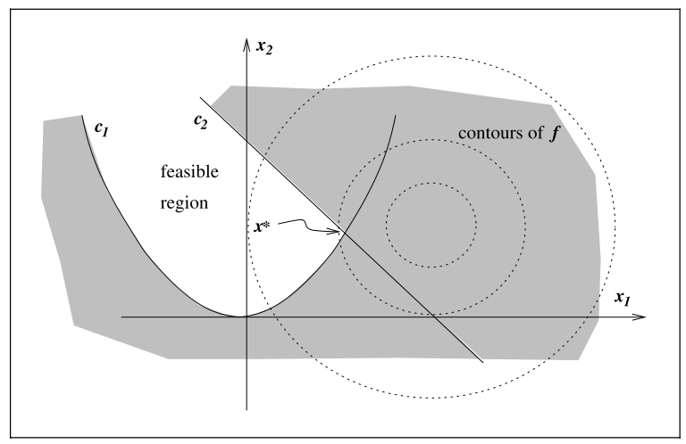

The above equations can be written as followed:
$$
f(x) =(x_1-2)^2+(x_2-1)^2, \quad x=\begin{bmatrix}x1\\x2\end{bmatrix},\\
c(x)=\begin{bmatrix}\quad c_1(x)\quad\\\quad c_2(x)\quad\end{bmatrix}=\begin{bmatrix}-{x_1}^2+x_2\\\quad-x_1+-x_2+2\quad\end{bmatrix}, I=\{1,2\}, E=\empty
$$
:heavy_check_mark: The $x^*$ is the minimal solution.

## 1.2 A Transportation Problem

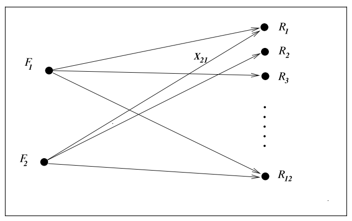

$F_i$ : factory

​	$a_i$: tons of certain products by factory $F_i$

$R_i$: Retail outlets

​	$b_i$: demands of tons of the product by retail outlet $R_i$

$c_{ij}$: cost of shipping per ton of the product from $F_i$ to 

$x_{ij}, i=1,2, j=1,...,12$:  where $x_{ij}$ is the number of tons of product shipped from factory $F_i$ to retail outlet $R_j$

> ​	To conclude, the optimization can be written as:

$$
\begin{aligned}
\text{min}&\sum_{ij}c_{ij}x_{ij}\\
\text{subject to }&\sum_{j=1}^{12}x_{ij}\leq a_i,\quad i=1,2\\
&\sum_{i=1}^{2}x_{ij}\geq b_j,\quad j=1,...,12\\
&x_{ij}\geq0,\quad i=1,2, \quad j=1,...,12
\end{aligned}
$$

:star:This is a **linear** problem.

But if there is a fee for storing product, then the cost is 
$$
\sum_{ij}c_{ij}\sqrt{{\epsilon}+x_{ij}}
$$
:star: This is a **non-linear** problem!

## 1.3 Continuous Versus Discrete Optimization

Continuous optimization is easier than discrete optimization.

**continuous optimization**:

$x$​ is infinite, real number

> example in `1.1`

**discrete optimization**:

$x$ is finite, the output may be changed significantly as we vary $x$

> **integer programming** : constraints, which have the form $x_i ∈ Z$,where $Z$ is the set of **integers**($x_i ∈\{1,2,5\}$), or **binary constraints**($x_i ∈\{0, 1\}$​)

> **mixed integer programming**(MIP) : both integer or binary constraints.

## 1.4 Constrained and Unconstrained Optimization Problems

**Unconstrained optimization**

> e.g. $E = I = \empty$

**Constrained optimization**

> e.g. $0\leq x_i\leq 100,\sum_ix_i\leq1$

## 1.5 Global and Local Optimization

In linear programming / convex programming:

> global solution = local solution

In non-linear programming:

> ​	tend to find local solution, since global is hard to find

## 1.6 Stochastic and Deterministic Optimization

**Certainty**:

> ​	Deterministic optimization

**Uncertainty**:

> ​	stochastic optimization => a number of **possible scenarios** to optimize the **expected** performance
>
> ​	chance-constrained optimization => ensure $x$​ **satisfy** constraints with **some probability**
>
> ​	robust optimization =>  certain constraints to hold for **all possible values** of the **uncertain data**.

## 1.7Convexity

:star:This is the fundamental concept in optimization. In CHN, convex is 凸，not 秃

**Convex Set Definition**: A set $S \in \mathbb{R}^n$​​ is a convex set if line connecting any two points lies inside $S$​​. For any two points $x\in S\space\text{and}\space y\in S$, we have $ax+(1-a)y\in S$ , for all $a\in [0,1]$

Left: Non-convex, Right: Convex

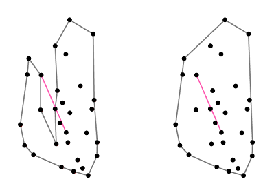

**Convex Function**: its domain $S$ is a convex set and for any two point $x$ and $y$ in $S$, the following is satisfied:
$$
f(ax+(1-a)y)\leq af(x)+(1-a)f(y), \quad \text{for all }a\in [0,1]
$$

:question: You may wonder is this convex?? why not concave??	Yes, function is said to be *concave* if it is *convex*.

**Strictly convex**: $x\neq y$ in the formula (6) AND $a$ is in the open interval $(0,1)$

**Linear function = convex**:
$$
f(x)=c^Tx+a
$$

> ​	$c$ : vector $\in\mathbb{R}$

> ​	$a$: scalar

**Quadratic function = convex**:
$$
f(x) = x^T Hx
$$

> ​	$H$ : symmetric positive semidefinite matrix

**Unit ball = convex:**
$$
\{y ∈ \mathbb{R}^n\quad |\quad\norm{y}_2\leq 1\}
$$
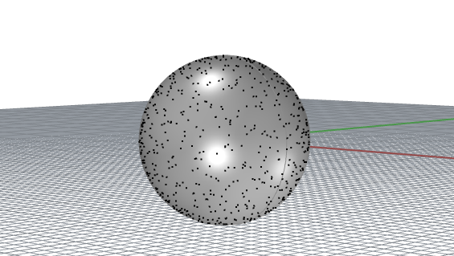

**polyhedron = convex:**
$$
\{x ∈ \mathbb{R}^n\quad |\quad Ax = b, \quad Cx ≤ d\}
$$

> ​	$A,C$: matrices of appropriate dimension

> ​	$b, d$ :vectors.

:star: If the **objective function** in the optimization problem (formula 1) and the **feasible region** are **both convex**, then **any local solution** of the problem **is** in fact a **global solution**.

**Convex programming**

It is a special case of general constrained optimization problem.

> ​	the objective function is convex,
>
> ​	the equality constraint functions $c_i (·), i ∈ E, $are linear
>
> ​	the inequality constraint functions $c_i (·), i ∈ I$,are concave.

## 1.8Optimization Algorithms

:star: They are all **iterative** process.

Good algorithms must:

> ​	**Robustness, Efficiency, Accuracy**

The wisdom is to **manage the tradeoffs** between convergence rate and storage requirements, and between robustness and speed, and so on, are central issues in numerical optimization. Because no algorithm is perfect and they all have pros and cons.

# Chapter 2 Fundamentals of Unconstrained Optimization

**Unconstrained Optimization**：

> ​	1. variable: real number$\mathbb{R}$​ with no restrictions(infinite)
>
> ​	2. formula: $\text{min}_xf(x)$​
>
> ​	3. $x\in \mathbb{R}^n$ : is a real vector, $n\geq 1$
>
> ​	4. $f:\mathbb{R}^n \to \mathbb{R}$​ , is a smooth function
>
> ​	5. characteristic:lack of global perspective on the function(due to 1.), only some scope on $x_1,x_2,...$

**Example on unconstrained optimization:**

<figure>
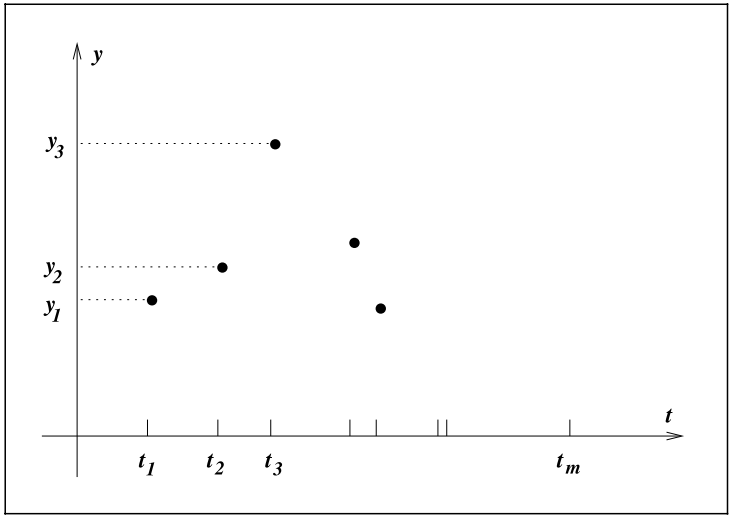  <figcaption>Least squares data fitting problem</figcaption>

</figure>
Taking the above problem, we can take down the process into

> 1. inspect the data
> 2. deduce the signal with possible solution
> 3. detect exponential and oscillatory behavior
> 4. write a formula
> 5. $\phi(t;x)=x_1+x_2e^{-(x_3-t^2)/4}+x_5cos(x_6t)$
> 6. $t$: times at $x$ axis, (input)
> 7. y: output
> 8. $x_i,i=1,2,...6$ : the parameter of the model
> 9. therefore $x_i$ can also be written as a vector: $x=(x_1,x_2,...,x_6)^T$
> 10. What to do? Minimize the discrepancy between $\phi(t;x)$ and $y_t$
> 11. $r_j(x)=y_j-\phi(t_j;x),\quad j=1,2,...,m$    m is the amount of input data

Written formally:
$$
\min_{x\in\mathbb{R}^6} f(x)=r_1^2(x)+r_2^2(x)+...+r_m^2(x)
$$
:star:This is so-called **non-linear least-squares problems**(非线性最小二乘问题). 

Quick question why **square** the $r_i$? Because the residual can be negative.

## 2.1What is a solution?

**Global minimizer:**

> ​	A point $x^*$ is a global minimizer if $f(x^*)\leq f(x)$ for all $x\in\mathbb{R}^n$​

**Local minimizer:**

> ​	A point $x^∗$ is a local minimizer if there is a neighborhood $N$ of $x^∗$ such that $f(x^∗) ≤ f(x)$for all $x ∈ N$.

**Weak local minimizer:**

> ​	copy definition from `local minimizer`, + when $N$​ is an open set that contains $x^*$​​ , e.g. $N=[0,2], x^*=2$​
>
> ​	e.g. $f(x)=2$​, where every point is weal local minimizer

**Strict/Strong local minimizer:**

> ​	A point $x^∗$​​ is a strict local minimizer if there is a neighborhood $N$​​ of $x^∗$​​ such that $f(x^∗) < f(x)$​​for all $x ∈ N$​ with $x\neq x^*$​​​.
>
> <figure>
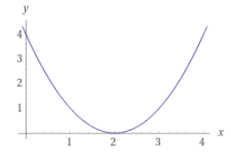  <figcaption>e.g. f(x)=(x-2)^2</figcaption>

> </figure>

**Isolated local minimizer:**

> ​	This is a little bit confusing thinking together with `strict local minimizer`.
>
> ​	:star: The solid conclusion is **isolated local minimizer** **$\subset$​​ strict local minimizer** 
>
> ​	What the hell?!  OK, please recall the methodology of **infinity** and look at the following formula:
>
> ​	$f(x)=x^4cos(1/x)+2x^4$
>
> 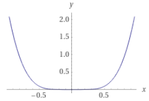
>
> 
>
> 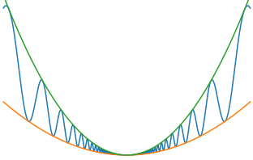
>
> ​	Nothing special in the beginning, but if we zoom in around 0, we can notice that the curve **oscillates** very much!! Therefore, if we think about $x_j\to0$, there are infinite points are local minimizer whose value=0. Therefore $j\to\infin$​, there are many many **strict local minimizers** but NONE of them are **isolated local minimizer**.

So in future practice, we should pay attention to those crazy function may be "trapped".

<figure>
 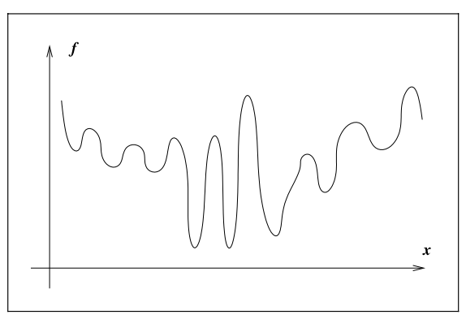 <figcaption>A difficult case for global minimization</figcaption>

</figure>

### Recognizing a local minimum

> ​	How to recognize a local minimum without examining all the points?
>
> > ​		:star:In particular, if $f$ is ***twice continuously differentiable***, we may be able to tell that $x^∗$ is a **local minimizer** (and possibly a strict local minimizer) by examining just the gradient $∇ f(x^∗)$ and the Hessian $∇^2 f(x^∗)$.

In the following, few theorem will be used and introduced multiple times.

#### Theorem 2.1 (Taylor's Theorem)

> ​	**Prerequisites**: $f :\mathbb{R}^n → \mathbb{R}$ is continuously differentiable and that $p ∈ \mathbb{R}^n$     (***first continuously differentiable***)
>
> ​	then we have:

$$
f(x + p) = f(x) +∇ f(x + tp)^T p,
$$

> ​	for some $t\in (0,1)$, if $f$​​ is  ***twice continuously differentiable***, 
>
> ​	then we have:

$$
∇ f(x + p) =∇ f(x) +\int^{1}_{0}∇^2 f(x + tp)pdt\\
f(x + p) = f(x) +∇ f(x)^T p + \frac{1}{2} p^T∇^2 f(x + tp)p
$$

#### Theorem 2.2 (First-Order Necessary Conditions)

> ​	**Prerequisites**: If $x^∗$ is a **local minimizer** and $f$ is **continuously differentiable** in an open neighborhood of $x^∗$, 
>
> ​	then we have: 

$$
∇ f(x^∗) = 0
$$

> ​	To see it geometrically:

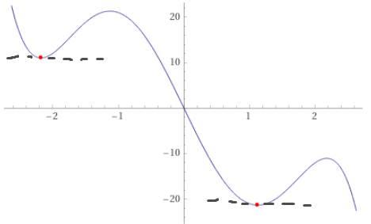

> ​	Fun fact: the point $x^*$ are also called ***stationary point***.

// TODO Explain and proof 

#### Theorem 2.3 (Second-Order Necessary Conditions)

> ​	**Prerequisites**: $x^∗$ is a **local minimizer** of $f$ and **$∇^2 f$ exists** and is **continuous** in an open neighborhood of $x^*$​,
>
> ​	then we have:

$$
∇ f(x^∗) = 0 \text{ and }∇^2 f(x^∗) \text{ is positive semidefinite}
$$

// TODO Explain and proof, and add texts of `positive semidefinite`.

#### Theorem 2.4 (Second-Order Sufficient Conditions)

> ​	**Prerequisites**: $∇^2 f$ is **continuous** in an open neighborhood of $x^∗$ and that $∇ f(x^∗)= 0$ and $∇^2 f(x^∗)$​ is **positive definite**,
>
> ​	then we have:

$$
x^∗ \text{ is a strict local minimizer of }f
$$

// TODO add example and proof

#### Theorem 2.5

> ​	**Prerequisites**: When $f$ is **convex**, then we have:

$$
\text{any local minimizer }x^∗ \text{ is a global minimizer of }f
$$

> ​	**Prerequisites**: if in addition $f$ is **differentiable**, then we have:

$$
\text{any stationary point } x^∗\text{ is a global minimizer of }f
$$

#### Conclusion of theorem 2.1 to 2.5

These results, which **are based on elementary calculus**, provide **the foundations for unconstrained optimization algorithms**. In one way or another, **all algorithms seek a point where** $∇ f(·)$ vanishes.

### Non-smooth Problem

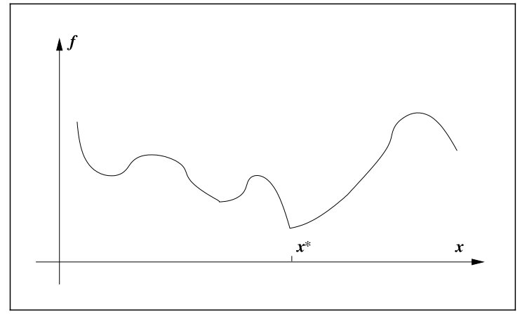

> ​	What it is?

Geometrically, the nonsmooth function consists of a few smooth pieces, with **discontinuities between the pieces**.

> ​	So what we gonna do?

It may be possible to find the minimizer by **minimizing each smooth piece individually**, a.k.a. examing the **subgradient** and **generalized gradient**.

(a side note, this book will not cover non-smooth problem.)

## 2.2Overview of algorithm

All algorithms for unconstrained minimization require the user to supply a starting point, which we usually denote by $x_0$

