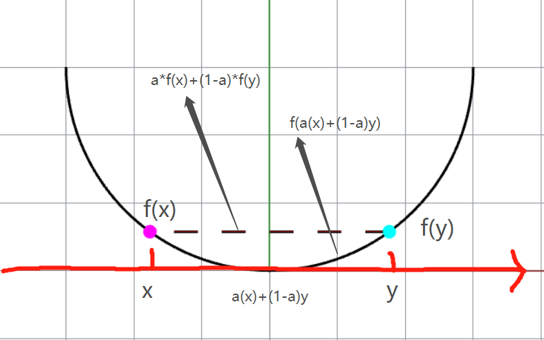

# Numerical Optimization
People optimize.  This is a repo for my notes and exercise of Book Numerical Optimization by J. Nocedal, S.J. Wright

# Chapter 1 Introduction

:star:Elements of optimization:package:

> `objective`: sth. need to be first defined with quantitative measure.
>
> `variable / unknown`: the characteristics of the system, which can optimize the objective
>
> `constraint` : the constraint of variables
>
> `modeling` : the process identifying objectives, variables, and constraints for a given problem
>
> `algorithm` : no universal one, but should find the tailored one related to the objective
>
> `optimality condition` : mathematical expression checking whether it is a good solution
>
> `sensitivity analysis` :	possible solution to improve

## 1.1 Mathematical Formulation

:star:(mathematical speaking) Optimization is the minimization / maximization of a function subject to constraints on its variables.

- $x$ - variable, unknown, parameters
- $f$ - objective function(scalar function) of $x$ 
- $c_i$ - constraint function(scalar function) of $x$ where must be satisfied

$$
\text{min}_{x\in\R^n}\space f(x)\space\space\text{subject to}\space\space
        \begin{cases}
                c_i(x)=0, & i\in\Epsilon\,,  \\
                c_i(x)\geq0, & i\in I\,.
        \end{cases}
$$

Let's take an example:
$$
\text{min}(x_1-2)^2+(x_2-1)^2\space\space \text{subject to}        
\begin{cases}
                x_1^2-x_2\leq0,  \\
                x_1+x_2\leq2.
        \end{cases}
$$
$(x_1-2)^2+(x_2-1)^2$ is a bunch of circle

$x_1^2-x_2\leq0$ is parabolic curve

$ x_1+x_2\leq2$​ is a linear curve

The above equation can be illustrated as followed:

The above equations can be written as followed:
$$
f(x) =(x_1-2)^2+(x_2-1)^2, \quad x=\begin{bmatrix}x1\\x2\end{bmatrix},\\
c(x)=\begin{bmatrix}\quad c_1(x)\quad\\\quad c_2(x)\quad\end{bmatrix}=\begin{bmatrix}-{x_1}^2+x_2\\\quad-x_1+-x_2+2\quad\end{bmatrix}, I=\{1,2\}, E=\empty
$$
:heavy_check_mark: The $x^*$ is the minimal solution.

## 1.2 A Transportation Problem

$F_i$ : factory

​	$a_i$: tons of certain products by factory $F_i$

$R_i$: Retail outlets

​	$b_i$: demands of tons of the product by retail outlet $R_i$

$c_{ij}$: cost of shipping per ton of the product from $F_i$ to 

$x_{ij}, i=1,2, j=1,...,12$:  where $x_{ij}$ is the number of tons of product shipped from factory $F_i$ to retail outlet $R_j$

> ​	To conclude, the optimization can be written as:

$$
\begin{aligned}
\text{min}&\sum_{ij}c_{ij}x_{ij}\\
\text{subject to }&\sum_{j=1}^{12}x_{ij}\leq a_i,\quad i=1,2\\
&\sum_{i=1}^{2}x_{ij}\geq b_j,\quad j=1,...,12\\
&x_{ij}\geq0,\quad i=1,2, \quad j=1,...,12
\end{aligned}
$$

:star:This is a **linear** problem.

But if there is a fee for storing product, then the cost is 
$$
\sum_{ij}c_{ij}\sqrt{{\epsilon}+x_{ij}}
$$
:star: This is a **non-linear** problem!

## 1.3 Continuous Versus Discrete Optimization

Continuous optimization is easier than discrete optimization.

**continuous optimization**:

$x$​ is infinite, real number

> example in `1.1`

**discrete optimization**:

$x$ is finite, the output may be changed significantly as we vary $x$

> **integer programming** : constraints, which have the form $x_i ∈ Z$,where $Z$ is the set of **integers**($x_i ∈\{1,2,5\}$), or **binary constraints**($x_i ∈\{0, 1\}$​)

> **mixed integer programming**(MIP) : both integer or binary constraints.

## 1.4 Constrained and Unconstrained Optimization Problems

**Unconstrained optimization**

> e.g. $E = I = \empty$

**Constrained optimization**

> e.g. $0\leq x_i\leq 100,\sum_ix_i\leq1$

## 1.5 Global and Local Optimization

In linear programming / convex programming:

> global solution = local solution

In non-linear programming:

> ​	tend to find local solution, since global is hard to find

## 1.6 Stochastic and Deterministic Optimization

**Certainty**:

> ​	Deterministic optimization

**Uncertainty**:

> ​	stochastic optimization => a number of **possible scenarios** to optimize the **expected** performance
>
> ​	chance-constrained optimization => ensure $x$​ **satisfy** constraints with **some probability**
>
> ​	robust optimization =>  certain constraints to hold for **all possible values** of the **uncertain data**.

## 1.7Convexity

:star:This is the fundamental concept in optimization. In CHN, convex is 凸，not 秃

**Convex Set Definition**: A set $S \in \mathbb{R}^n$​​ is a convex set if line connecting any two points lies inside $S$​​. For any two points $x\in S\space\text{and}\space y\in S$, we have $ax+(1-a)y\in S$ , for all $a\in [0,1]$

Left: Non-convex, Right: Convex

**Convex Function**: its domain $S$ is a convex set and for any two point $x$ and $y$ in $S$, the following is satisfied:
$$
f(ax+(1-a)y)\leq af(x)+(1-a)f(y), \quad \text{for all }a\in [0,1]
$$

:question: You may wonder is this convex?? why not concave??	Yes, function is said to be *concave* if it is *convex*.

**Strictly convex**: $x\neq y$ in the formula (6) AND $a$ is in the open interval $(0,1)$

**Linear function = convex**:
$$
f(x)=c^Tx+a
$$

> ​	$c$ : vector $\in\mathbb{R}$

> ​	$a$: scalar

**Quadratic function = convex**:
$$
f(x) = x^T Hx
$$

> ​	$H$ : symmetric positive semidefinite matrix

**Unit ball = convex:**
$$
\{y ∈ \mathbb{R}^n\quad |\quad\norm{y}_2\leq 1\}
$$

**polyhedron = convex:**
$$
\{x ∈ \mathbb{R}^n\quad |\quad Ax = b, \quad Cx ≤ d\}
$$

> ​	$A,C$: matrices of appropriate dimension

> ​	$b, d$ :vectors.

:star: If the **objective function** in the optimization problem (formula 1) and the **feasible region** are **both convex**, then **any local solution** of the problem **is** in fact a **global solution**.

**Convex programming**

It is a special case of general constrained optimization problem.

> ​	the objective function is convex,
>
> ​	the equality constraint functions $c_i (·), i ∈ E, $are linear
>
> ​	the inequality constraint functions $c_i (·), i ∈ I$,are concave.

## 1.8Optimization Algorithms

:star: They are all **iterative** process.

Good algorithms must:

> ​	**Robustness, Efficiency, Accuracy**

The wisdom is to **manage the tradeoffs** between convergence rate and storage requirements, and between robustness and speed, and so on, are central issues in numerical optimization. Because no algorithm is perfect and they all have pros and cons.

