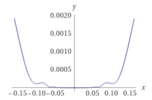

# Chapter 2 Fundamentals of Unconstrained Optimization

**Unconstrained Optimization**：

> ​	1. variable: real number$\mathbb{R}$​ with no restrictions(infinite)
>
> ​	2. formula: $\text{min}_xf(x)$​
>
> ​	3. $x\in \mathbb{R}^n$ : is a real vector, $n\geq 1$
>
> ​	4. $f:\mathbb{R}^n \to \mathbb{R}$​ , is a smooth function
>
> ​	5. characteristic:lack of global perspective on the function(due to 1.), only some scope on $x_1,x_2,...$

**Example on unconstrained optimization:**

<figure>
  <figcaption>Least squares data fitting problem</figcaption>

</figure>
Taking the above problem, we can take down the process into

> 1. inspect the data
> 2. deduce the signal with possible solution
> 3. detect exponential and oscillatory behavior
> 4. write a formula
> 5. $\phi(t;x)=x_1+x_2e^{-(x_3-t^2)/4}+x_5cos(x_6t)$
> 6. $t$: times at $x$ axis, (input)
> 7. y: output
> 8. $x_i,i=1,2,...6$ : the parameter of the model
> 9. therefore $x_i$ can also be written as a vector: $x=(x_1,x_2,...,x_6)^T$
> 10. What to do? Minimize the discrepancy between $\phi(t;x)$ and $y_t$
> 11. $r_j(x)=y_j-\phi(t_j;x),\quad j=1,2,...,m$    m is the amount of input data

Written formally:
$$
\min_{x\in\mathbb{R}^6} f(x)=r_1^2(x)+r_2^2(x)+...+r_m^2(x)
$$
:star:This is so-called **non-linear least-squares problems**(非线性最小二乘问题). 

Quick question why **square** the $r_i$? Because the residual can be negative.

## 2.1What is a solution?

**Global minimizer:**

> ​	A point $x^*$ is a global minimizer if $f(x^*)\leq f(x)$ for all $x\in\mathbb{R}^n$​

**Local minimizer:**

> ​	A point $x^∗$ is a local minimizer if there is a neighborhood $N$ of $x^∗$ such that $f(x^∗) ≤ f(x)$for all $x ∈ N$.

**Weak local minimizer:**

> ​	copy definition from `local minimizer`, + when $N$​ is an open set that contains $x^*$​​ , e.g. $N=[0,2], x^*=2$​
>
> ​	e.g. $f(x)=2$​, where every point is weal local minimizer

**Strict/Strong local minimizer:**

> ​	A point $x^∗$​​ is a strict local minimizer if there is a neighborhood $N$​​ of $x^∗$​​ such that $f(x^∗) < f(x)$​​for all $x ∈ N$​ with $x\neq x^*$​​​.
>
> <figure>
  <figcaption>e.g. f(x)=(x-2)^2</figcaption>

> </figure>

**Isolated local minimizer:**

> ​	This is a little bit confusing thinking together with `strict local minimizer`.
>
> ​	:star: The solid conclusion is **isolated local minimizer** **$\subset$​​ strict local minimizer** 
>
> ​	What the hell?!  OK, please recall the methodology of **infinity** and look at the following formula:
>
> ​	$f(x)=x^4cos(1/x)+2x^4$
>
> 
>
> 
>
> 
>
> ​	Nothing special in the beginning, but if we zoom in around 0, we can notice that the curve **oscillates** very much!! Therefore, if we think about $x_j\to0$, there are infinite points are local minimizer whose value=0. Therefore $j\to\infin$​, there are many many **strict local minimizers** but NONE of them are **isolated local minimizer**.

So in future practice, we should pay attention to those crazy function may be "trapped".

<figure>
  <figcaption>A difficult case for global minimization</figcaption>

</figure>

### Recognizing a local minimum

> ​	How to recognize a local minimum without examining all the points?
>
> > ​		:star:In particular, if $f$ is ***twice continuously differentiable***, we may be able to tell that $x^∗$ is a **local minimizer** (and possibly a strict local minimizer) by examining just the gradient $∇ f(x^∗)$ and the Hessian $∇^2 f(x^∗)$.

In the following, few theorem will be used and introduced multiple times.

#### Theorem 2.1 (Taylor's Theorem)

> ​	**Prerequisites**: $f :\mathbb{R}^n → \mathbb{R}$ is continuously differentiable and that $p ∈ \mathbb{R}^n$     (***first continuously differentiable***)
>
> ​	then we have:

$$
f(x + p) = f(x) +∇ f(x + tp)^T p,
$$

> ​	for some $t\in (0,1)$, if $f$​​ is  ***twice continuously differentiable***, 
>
> ​	then we have:

$$
∇ f(x + p) =∇ f(x) +\int^{1}_{0}∇^2 f(x + tp)pdt\\
f(x + p) = f(x) +∇ f(x)^T p + \frac{1}{2} p^T∇^2 f(x + tp)p
$$

#### Theorem 2.2 (First-Order Necessary Conditions)

> ​	**Prerequisites**: If $x^∗$ is a **local minimizer** and $f$ is **continuously differentiable** in an open neighborhood of $x^∗$, 
>
> ​	then we have: 

$$
∇ f(x^∗) = 0
$$

> ​	To see it geometrically:

> ​	Fun fact: the point $x^*$ are also called ***stationary point***.

// TODO Explain and proof 

#### Theorem 2.3 (Second-Order Necessary Conditions)

> ​	**Prerequisites**: $x^∗$ is a **local minimizer** of $f$ and **$∇^2 f$ exists** and is **continuous** in an open neighborhood of $x^*$​,
>
> ​	then we have:

$$
∇ f(x^∗) = 0 \text{ and }∇^2 f(x^∗) \text{ is positive semidefinite}
$$

// TODO Explain and proof, and add texts of `positive semidefinite`.

#### Theorem 2.4 (Second-Order Sufficient Conditions)

> ​	**Prerequisites**: $∇^2 f$ is **continuous** in an open neighborhood of $x^∗$ and that $∇ f(x^∗)= 0$ and $∇^2 f(x^∗)$​ is **positive definite**,
>
> ​	then we have:

$$
x^∗ \text{ is a strict local minimizer of }f
$$

// TODO add example and proof

#### Theorem 2.5

> ​	**Prerequisites**: When $f$ is **convex**, then we have:

$$
\text{any local minimizer }x^∗ \text{ is a global minimizer of }f
$$

> ​	**Prerequisites**: if in addition $f$ is **differentiable**, then we have:

$$
\text{any stationary point } x^∗\text{ is a global minimizer of }f
$$

#### Conclusion of theorem 2.1 to 2.5

These results, which **are based on elementary calculus**, provide **the foundations for unconstrained optimization algorithms**. In one way or another, **all algorithms seek a point where** $∇ f(·)$ vanishes.

### Non-smooth Problem

> ​	What it is?

Geometrically, the nonsmooth function consists of a few smooth pieces, with **discontinuities between the pieces**.

> ​	So what we gonna do?

It may be possible to find the minimizer by **minimizing each smooth piece individually**, a.k.a. examing the **subgradient** and **generalized gradient**.

(a side note, this book will not cover non-smooth problem.)

## 2.2Overview of algorithm

All algorithms for unconstrained minimization require the user to supply a starting point, which we usually denote by $x_0$

